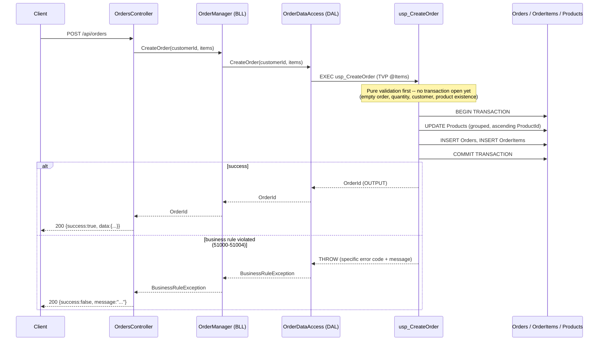
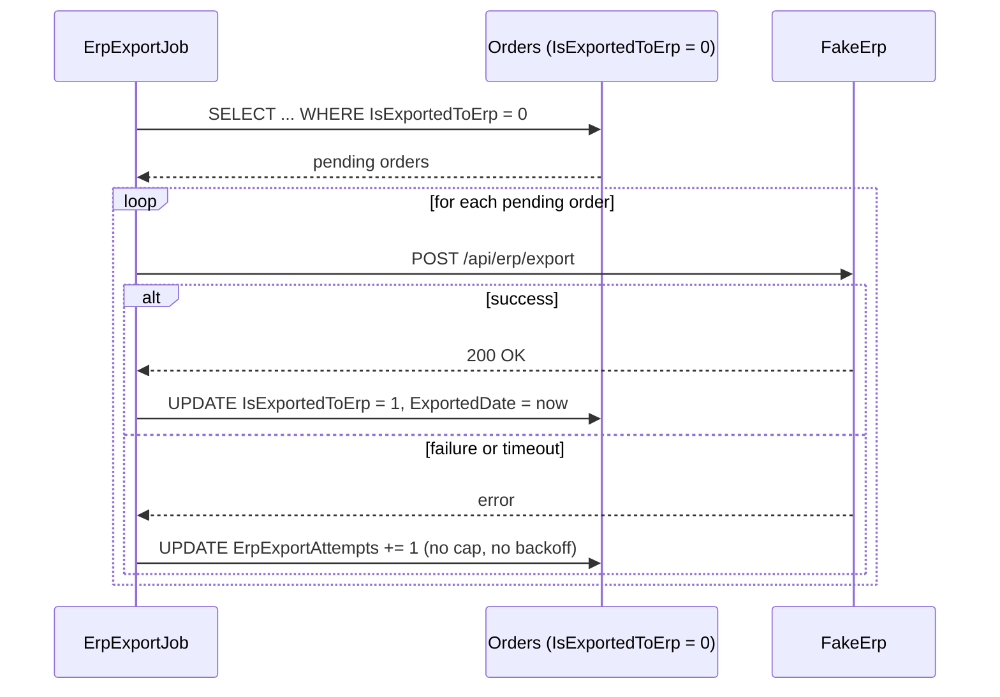

# M0 Legacy Flow

This document describes the **current M0 baseline only** — the deliberately simple, legacy-style
3-tier flow that exists today. It is not a description of the target architecture. M1 introduces a
separate `Domain`/`Application`/`Infrastructure`/`Api` skeleton alongside these legacy projects;
that flow will look meaningfully different and is documented separately once it exists. Do not
read this page as a preview of M1 — it isn't one.

## Order creation

**Where the transaction starts:** inside `usp_CreateOrder`, not in C#. Validation that never
writes anything happens before `BEGIN TRANSACTION` — there's nothing to roll back, so it just
throws. The transaction wraps only the actual mutation (stock update + inserts), kept as narrow as
possible.

**Why the layers are separate even though M0 is "just legacy":** `OrdersController` knows HTTP,
not business rules. `OrderManager` orchestrates, and knows neither HTTP nor SQL. `OrderDataAccess`
knows SQL, not HTTP. Nothing today *requires* this separation to work — but M2 will split these
concerns into real modules, and the seams already existing here (even around code that's
deliberately unsophisticated) make that split cheaper than starting from a single fused layer.

## ERP export

`ErpExportJob` is a one-shot, Task-Scheduler-style process: it polls once, processes whatever it
finds, and exits — it is not a daemon. It also does not share `CommerceFlow.Legacy.DAL` with the
rest of the app; see [`../legacy-technical-debt.md`](../legacy-technical-debt.md) for why that's
deliberate.

## Connection string handling

`OrderDataAccess` reads its connection string from the `COMMERCEFLOW_DB_CONNECTION` environment
variable at construction time — never from a literal in source. Embedding it in code would mean a
different build per environment, a real risk of a password landing in git history (which never
fully goes away once it's there), and no guard against a developer's local run accidentally
pointing at a shared or production database.
